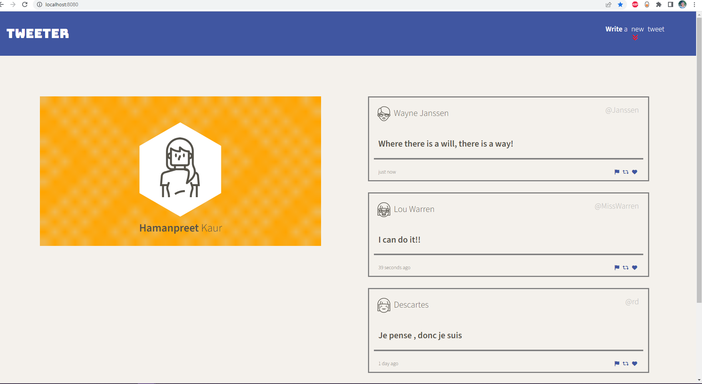
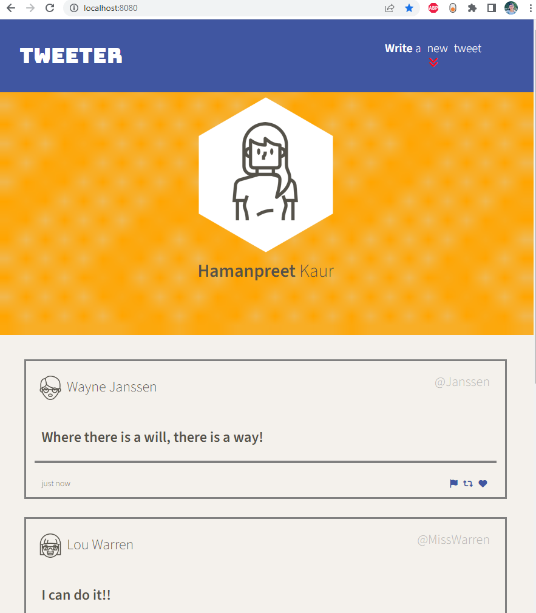

# Tweeter Project

Welcome to Tweeter, a simple and stylish single-page Twitter clone that allows you to express yourself in 140 characters or less. Whether you want to share your thoughts, engage with others, or stay updated with the latest trends, Tweeter has got you covered!

This repository is the starter code for the project: Students will fork and clone this repository, then build upon it to practice their front-end and back-end skills.

## Features

- Real-time Tweeting: Experience the thrill of instant communication with our real-time tweeting functionality. As soon as you hit that Tweet button, your message will be broadcasted to the world.
- Responsive Design: Tweeter is designed to adapt seamlessly to various screen sizes and devices. From desktop to mobile, you'll have a delightful tweeting experience across all platforms.
- Character Counter: Stay within the limits! Handy character counter will keep track of your tweet length in real-time, ensuring you never exceed the maximum character limit.
- Dynamic UI: Enjoy a dynamic user interface with smooth transitions, visually appealing animations, and an intuitive design that enhances your tweeting experience.

## Technologies Used

Tweeter leverages a range of technologies and tools, including:

- HTML5 and CSS3: Building blocks for the structure and styling of the web app.
- SASS: A powerful CSS preprocessor used for more efficient and maintainable styling.
- JavaScript: Adding interactivity and dynamic behavior to the application.
- Node.js and Express: Providing the server-side runtime environment and handling backend functionality.
- jQuery and AJAX: Simplifying DOM manipulation and enabling asynchronous communication with the server.

## Final Product

## Getting Started

1. [Create](https://docs.github.com/en/repositories/creating-and-managing-repositories/creating-a-repository-from-a-template) a new repository using this repository as a template.
2. Clone your repository onto your local device.
3. Install dependencies using the `npm install` command.
3. Start the web server using the `npm run local` command. The app will be served at <http://localhost:8080/>.
4. Go to <http://localhost:8080/> in your browser to start exploring and tweeting!

## Dependencies

- Express
- Node 5.10.x or above
- body-parser
- chance
- md5

## Get in Touch

Have questions, suggestions, or feedback? Reach out to me at haman42626@gmail.com. I would love to hear from you!

Happy Tweeting! 🐦
